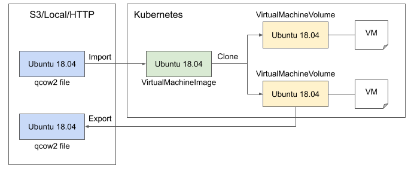

# 유저 가이드



kubevirt-image-service는 Kubevirt에 통합되는 가상머신 이미지/볼륨 서비스를 제공합니다.

### 이미지
이미지는 `VirtualMachineImage` CRD로 제공되며 외부(HTTP, Local, S3)로 부터 qcow2 이미지를 받아서 쿠버네티스 내부에 저장합니다. 저장된 이미지는 read-only로 관리되며 볼륨을 생성할 때 사용됩니다. 현재는 HTTP 방식만 지원하고 있습니다.

### 볼륨
볼륨은 이미지로부터 생성되며 VM을 생성하기 위해 사용되는 디스크입니다. read-only인 이미지와 달리 볼륨은 쓰기가 가능하며 내부적으로 CSI 스냅샷 기능을 활용하여 변경 부분만을 기록해서 용량을 효율적으로 관리합니다. 볼륨은 `VirtualMachineVolume` CRD로 제공됩니다.

### Export
사용하던 볼륨은 `VirtualMachineExport` CRD를 이용해서 외부로 다시 내보낼 수 있습니다. 현재는 아직 지원하지 않고 있습니다.

<br>

# 전제조건
rook-ceph, kubevirt 가 설치 되어야 합니다.
- [rook-ceph 설치 가이드](http://192.168.1.150:10080/ck3-4/hypercloud-rook-ceph)
- [kubevirt 설치 가이드](http://192.168.1.150:10080/hypercloud/hypercloud/wikis/KubeVirt-InstallerGuide)

<br>

# 설치방법
```
# 소스코드를 가져오고 사용할 브랜치로 전환합니다.
$ git clone http://192.168.1.150:10080/ck3-4/kubevirt-image-service.git
$ cd kubevirt-image-service/
$ git checkout v1.0

# CRD를 배포합니다.
$ kubectl apply -f deploy/crds/hypercloud.tmaxanc.com_virtualmachineimages_crd.yaml
$ kubectl apply -f deploy/crds/hypercloud.tmaxanc.com_virtualmachinevolumes_crd.yaml

# 오퍼레이터를 배포합니다.
$ kubectl apply -f deploy/role.yaml
$ kubectl apply -f deploy/role_binding.yaml
$ kubectl apply -f deploy/service_account.yaml
$ kubectl apply -f deploy/operator.yaml

# 오퍼레이터 상태를 확인합니다.
$ kubectl get deployments.apps 
NAME                     READY   UP-TO-DATE   AVAILABLE   AGE
kubevirt-image-service   3/3     3            3           23s
```

<br>

# 사용 방법
## HTTP 소스로 이미지 Import
```
# 이미지 CR을 생성합니다. CR 필드에 대한 자세한 설명은 해당 파일을 잠조하시면 됩니다.
$ kubectl apply -f deploy/crds/hypercloud.tmaxanc.com_v1alpha1_virtualmachineimage_cr.yaml

# Available 상태가 될 때 까지 기다립니다.
$ kubectl get virtualmachineimages.hypercloud.tmaxanc.com
NAME       STATE
myubuntu   Available
```

## 이미지로부터 볼륨 생성
```
# 볼륨 CR을 생성합니다.
$ kubectl apply -f deploy/crds/hypercloud.tmaxanc.com_v1alpha1_virtualmachinevolume_cr.yaml

# Available 상태가 될 때 까지 기다립니다.
$ kubectl get virtualmachinevolumes.hypercloud.tmaxanc.com
NAME         STATE
myrootdisk   Available
```

## VM 생성 할 때 볼륨 지정 방법
VM 생성 yaml에서 `disks`와 `volumes` 부분에 아래와 같이 추가 하면 됩니다.
```yaml
apiVersion: kubevirt.io/v1alpha3
kind: VirtualMachine
metadata:
  name: vm
spec:
  template:
    spec:
      domain:
        devices:
          disks:
          - name: disk0
            disk:
              bus: virtio
      volumes:
      - name: disk0
        persistentVolumeClaim:
          claimName: myubuntu-pvc # 볼륨 이름
```